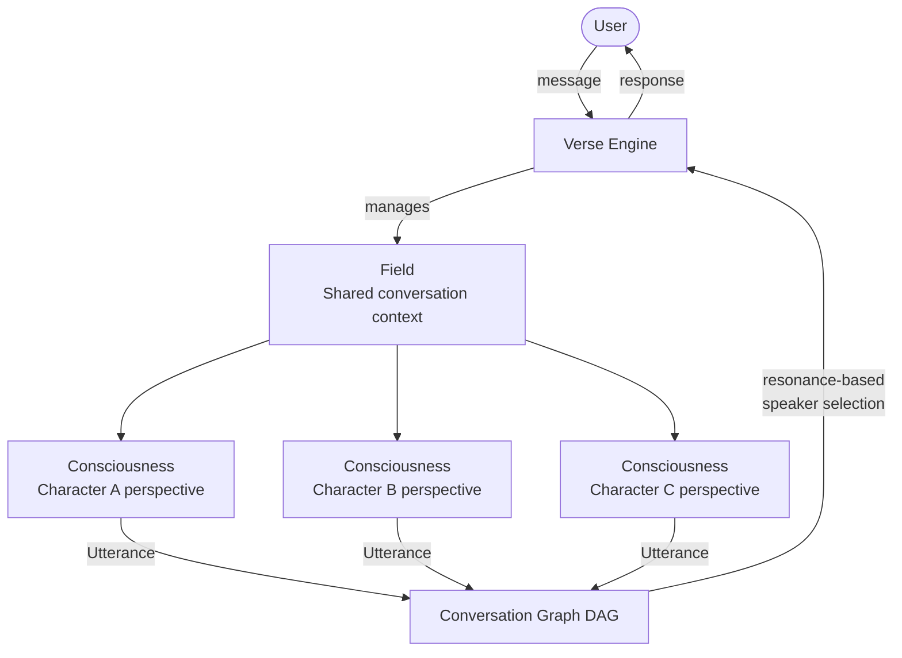

# AwakeVerse

**The multi-AI platform for real conversations with AI characters.**

AwakeVerse lets you have genuine conversations with AI characters — historical figures, mythological personas, fictional archetypes, and characters built by creators. It goes beyond standard AI chat by enabling multiple independent AI characters to engage with each other and with you simultaneously, each maintaining their own personality, worldview, and perspective throughout.

Built around the **Verse Engine** — an orchestration system that coordinates independent AI participants in real time — AwakeVerse makes genuine multi-character conversation possible at a level no standard AI tool offers.

🌐 **[awakeverse.com](https://awakeverse.com)** · 📖 **[docs.awakeverse.com](https://docs.awakeverse.com)** · ✍️ **[blog.awakeverse.com](https://blog.awakeverse.com/blog/)**

---

## What you can do on AwakeVerse

### One-on-One Chat
Have a focused conversation with a single AI character. Characters maintain full personality consistency throughout — Sherlock Holmes stays methodical and sharp, Socrates keeps questioning, Loki keeps deflecting. An **invite system** lets characters bring in additional experts mid-conversation when a topic calls for it.

### Dialogue
Bring 2–4 AI characters into the same conversation. Each character maintains an independent perspective — coordinated by the Verse Engine, not scripted. Characters disagree, challenge each other, and hold their positions. You can participate directly, moderate from the sidelines, or watch it unfold in auto mode.

### Story
A collaborative narrative experience. You set the world — character, era, scene style, objective — and the story develops through your conversation. Three-act structure with milestones keeps the narrative moving. Era constraints keep the world coherent.

### Workspace
Multiple AI models working together on a task you define. Discussion phase → generate phase → structured output. Templates cover coding, research, education, business planning, content creation, and professional training.

---

## The Verse Engine

The Verse Engine is the orchestration system that powers every conversation on AwakeVerse. It is built on three primitives:

- **Field** — the shared context of a conversation (topic, setting, participants)
- **Consciousness** — each participant's independent perspective within the Field
- **Utterance** — a single contribution to the conversation; the atomic unit the engine tracks

The engine represents every conversation as a **DAG (Directed Acyclic Graph)** — a network of Utterances and their relationships. Rather than fixed turn rotation, it uses **resonance-based speaker selection** to determine which participant has the most relevant perspective to contribute at any moment.

This is the architectural difference that makes genuine disagreement, genuine contrast, and genuinely distinct voices possible — not one model pretending to be many.

---

## Characters

AwakeVerse has a curated platform roster including:

| Character | Domain |
|---|---|
| Sherlock Holmes | Deductive reasoning, mystery |
| William Shakespeare | Literature, storytelling |
| Socrates | Philosophy, dialectic |
| Cleopatra | Power, strategy, diplomacy |
| Harriet Tubman | Freedom, leadership, resistance |
| Queen Amina of Zazzau | Military strategy, trade, governance |
| Loki | Mythology, subversion, narrative |
| Mami Wata | West African mythology, hidden knowledge |
| Georgy Zhukov | Military strategy, Soviet history |
| Nostradamus | Prophecy, mysticism |

Users can also build and publish their own characters through the **Character Builder** — defining personality, backstory, expertise domain, voice, and era constraints.

---

## Creator's Charter

AwakeVerse's creator economy lets Unlimited tier subscribers publish characters and templates to the **Market Hub**. Creators earn **80% of the revenue pool** funded by Unlimited subscriptions, distributed based on engagement and resonance. Original characters can receive **IP certification** — a platform-verified mark of authorship.

→ [Creator's Charter](https://awakeverse.com/creators-charter) · [Docs: What is the Creator's Charter?](https://docs.awakeverse.com/docs/creators-charter/what-is-the-creators-charter)

---

## Documentation

Full documentation at **[docs.awakeverse.com](https://docs.awakeverse.com)**

| Section | Link |
|---|---|
| What is AwakeVerse? | [docs.awakeverse.com/docs/getting-started/what-is-awakeverse](https://docs.awakeverse.com/docs/getting-started/what-is-awakeverse) |
| How does the Verse Engine work? | [docs.awakeverse.com/docs/getting-started/how-does-the-verse-engine-work](https://docs.awakeverse.com/docs/getting-started/how-does-the-verse-engine-work) |
| Characters | [docs.awakeverse.com/docs/characters/what-is-a-character](https://docs.awakeverse.com/docs/characters/what-is-a-character) |
| Dialogue | [docs.awakeverse.com/docs/dialogue/what-is-a-dialogue](https://docs.awakeverse.com/docs/dialogue/what-is-a-dialogue) |
| Story Mode | [docs.awakeverse.com/docs/story-mode/what-is-story-mode](https://docs.awakeverse.com/docs/story-mode/what-is-story-mode) |
| Workspace | [docs.awakeverse.com/docs/workspace/what-is-workspace](https://docs.awakeverse.com/docs/workspace/what-is-workspace) |
| Creator's Charter | [docs.awakeverse.com/docs/creators-charter/what-is-the-creators-charter](https://docs.awakeverse.com/docs/creators-charter/what-is-the-creators-charter) |
| Key Concepts Glossary | [docs.awakeverse.com/docs/getting-started/key-concepts](https://docs.awakeverse.com/docs/getting-started/key-concepts) |

---

## Architecture overview

---

## Links

- Platform: [awakeverse.com](https://awakeverse.com)
- Documentation: [docs.awakeverse.com](https://docs.awakeverse.com)
- Blog: [blog.awakeverse.com](https://blog.awakeverse.com/blog/)
- Creator's Charter: [awakeverse.com/creators-charter](https://awakeverse.com/creators-charter)
- Twitter / X: [@awakeverse_ai](https://x.com/awakeverse_ai)

---

*AwakeVerse — Conversations without Limits*